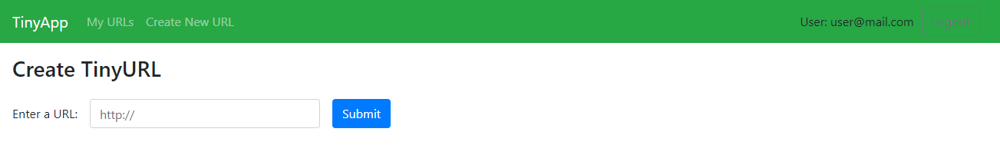
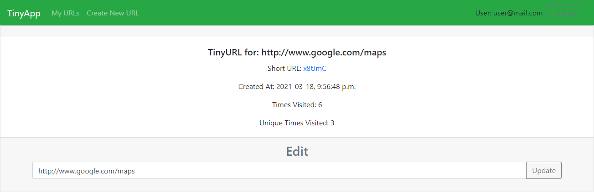
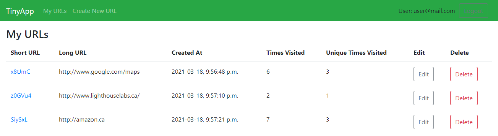

# TinyApp Project

TinyApp is a full stack web application built with Node and Express that allows users to shorten long URLs (à la bit.ly).

## Final Product

## Features
- Create shortened URLs
- Track when the URL was created
- Track how many times the URL has been used
- Update the destination URL
- Delete shortened URLs
- Secure: only you can see, edit, and delete your URLs

## Dependencies
- Node.js
- [bcrypt](https://www.npmjs.com/package/bcrypt)
- [cookie-session](https://www.npmjs.com/package/cookie-session)
- [ejs](https://www.npmjs.com/package/ejs)
- [express](https://www.npmjs.com/package/express)

## Getting Started

- Install all dependencies (using the `npm install` command).
- Run the development web server using the `npm run dev` command.
